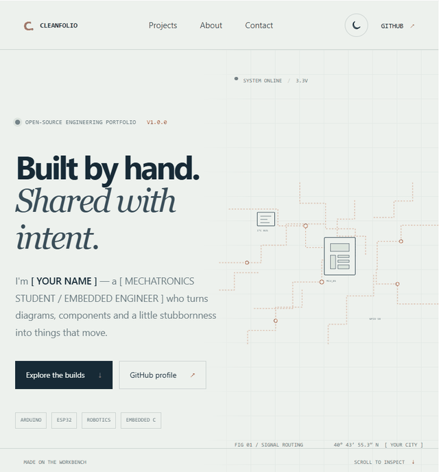

# Cleanfolio

> A free, open-source portfolio template for makers, mechatronics students, and embedded engineers.

Cleanfolio gives each build a real, indexable page for its story, circuit diagram, bill of materials, and firmware. Plain HTML, CSS, and JavaScript keep the site easy to fork and host. Node.js is used only for optional project and sitemap helpers.



## Preview

Local preview: run `npm run serve` and open [http://127.0.0.1:8000](http://127.0.0.1:8000).

Live demo: [YOUR-USERNAME.github.io/YOUR-REPO](https://YOUR-USERNAME.github.io/YOUR-REPO/)

## Features

- Animated circuit-trace hero with no third-party assets or runtime libraries
- Filterable project list, responsive layout, and remembered light/dark theme
- Three standalone example project pages with interactive, keyboard-accessible SVG diagrams
- Parts tables, code excerpts with copy buttons, project stories, and individual SEO metadata
- Project generator and sitemap/robots builder; the published site itself needs no build step
- GitHub Pages deployment workflow, custom 404, web-ready SVG favicon, and 1200 × 630 social preview artwork
- Semantic HTML, skip links, visible keyboard focus, descriptive labels, and reduced-motion support

## Make it yours

1. Fork this repository or use GitHub's **Use this template** button.
2. Edit `site.config.json`: set your display name, canonical site URL, email, and GitHub handle. For the standard Pages address, use `https://YOUR-USERNAME.github.io/YOUR-REPO/` including the final slash.
3. Replace `[ YOUR NAME ]`, `[ YOUR ROLE ]`, `YOUR-USERNAME`, `YOUR-REPO`, `YOUR-HANDLE`, and `hello@YOUR-DOMAIN.example` in `index.html`, `templates/project.html`, and `site.config.json`.
4. Update the Person JSON-LD and social links in `index.html`. Keep the website and canonical URLs consistent with the deployed site.
5. Review the three examples and replace their sample names, details, circuit pin notes, component lists, firmware, and dates with your own work.
6. Update `assets/og-image.svg` with your portfolio identity. It is a 1200 × 630 social preview image.
7. Run `npm run sitemap` to refresh `sitemap.xml` and `robots.txt` from `site.config.json`.
8. Push to `main`. In repository **Settings → Pages**, select **GitHub Actions** as the source. The included workflow publishes the repository root.

For a custom domain, set its URL in `site.config.json`, update the canonical and JSON-LD URLs in `index.html`, add the domain in GitHub Pages settings, and rebuild the sitemap.

## Local preview

Node.js 18 or newer is needed for the convenience server and scripts. There are no packages to install.

```sh
npm run serve
```

Alternatively, serve the repository root with any local static file server. Opening the HTML directly with `file://` is not recommended because browser module and clipboard permissions vary by browser.

## Add a project

```sh
node scripts/new-project.js "Line follower robot"
```

The generator creates `projects/line-follower-robot.html`, adds a row to the home page, and refreshes the sitemap and robots file. Open the generated HTML and replace its marked example details. `templates/project.html` defines the shared project page structure; generated project pages are ordinary HTML and are ready to publish.

The project data for the three original examples is in `scripts/project-data.js`. To recreate or refresh those pages from that source data:

```sh
npm run examples
```

To rebuild only search indexing files after editing pages or `site.config.json`:

```sh
npm run sitemap
```

### Circuit diagram viewer

In a project page, each component is a `<g>` inside the inline SVG with `data-part`, `data-name`, and `data-info` attributes. The viewer supports hover, keyboard focus, and tap. Describe signal names and pin mappings in `data-info`; keep the drawing's `aria-label` useful without interaction.

## Project structure

```text
index.html                     Portfolio home page
projects/                      One complete HTML page per build
assets/style.css               Shared responsive design and themes
assets/project.css             Project diagram and component styles
assets/main.js                 Theme, filters, and code-copy behavior
assets/diagram.js              Accessible circuit-part descriptions
assets/og-image.svg            1200 × 630 social preview artwork
templates/project.html         Source template for generated pages
scripts/new-project.js         Add a project from the command line
scripts/project-data.js        Three complete example project records
scripts/build-sitemap.js       Refresh sitemap.xml and robots.txt
.github/workflows/pages.yml   GitHub Pages deployment
```

## GitHub repository setup

Suggested description: `Free portfolio template for makers, robotics, Arduino and ESP32 projects.`

Suggested topics: `portfolio-template`, `arduino`, `esp32`, `robotics`, `mechatronics`, `embedded-systems`, `github-pages`, `open-source`.

The MIT license allows personal and commercial use. Circuit examples are educational starting points: check the voltage, current, pinout, mechanical limits, and power requirements of your actual components before building.

## Contributing

Bug reports, accessibility improvements, documentation fixes, and new project examples are welcome. Read [CONTRIBUTING.md](CONTRIBUTING.md) before opening a pull request.

## License

MIT. See [LICENSE](LICENSE).
